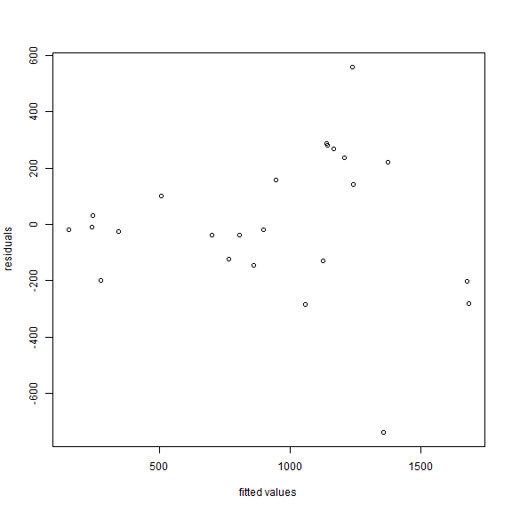

<!-- R Commander Markdown Template -->

Replace with Main Title
=======================

### Your Name

### 2021-02-10


```r
> data(hubble)
```


```r
> head(hubble, 25)
```

```
     Galaxy    y     x
1   NGC0300  133  2.00
2   NGC0925  664  9.16
3  NGC1326A 1794 16.14
4   NGC1365 1594 17.95
5   NGC1425 1473 21.88
6   NGC2403  278  3.22
7   NGC2541  714 11.22
8   NGC2090  882 11.75
9   NGC3031   80  3.63
10  NGC3198  772 13.80
11  NGC3351  642 10.00
12  NGC3368  768 10.52
13  NGC3621  609  6.64
14  NGC4321 1433 15.21
15  NGC4414  619 17.70
16 NGC4496A 1424 14.86
17  NGC4548 1384 16.22
18  NGC4535 1444 15.78
19  NGC4536 1423 14.93
20  NGC4639 1403 21.98
21  NGC4725 1103 12.36
22   IC4182  318  4.49
23  NGC5253  232  3.15
24  NGC7331  999 14.72
```


```r
> hub.mod <- lm(y~x-1, data=hubble)
```


```r
> summary(hub.mod)
```

```

Call:
lm(formula = y ~ x - 1, data = hubble)

Residuals:
   Min     1Q Median     3Q    Max 
-736.5 -132.5  -19.0  172.2  558.0 

Coefficients:
  Estimate Std. Error t value Pr(>|t|)    
x   76.581      3.965   19.32 1.03e-15 ***
---
Signif. codes:  0 '***' 0.001 '**' 0.01 '*' 0.05 '.' 0.1 ' ' 1

Residual standard error: 258.9 on 23 degrees of freedom
Multiple R-squared:  0.9419,	Adjusted R-squared:  0.9394 
F-statistic: 373.1 on 1 and 23 DF,  p-value: 1.032e-15
```


```r
> hubble
```

```
     Galaxy    y     x
1   NGC0300  133  2.00
2   NGC0925  664  9.16
3  NGC1326A 1794 16.14
4   NGC1365 1594 17.95
5   NGC1425 1473 21.88
6   NGC2403  278  3.22
7   NGC2541  714 11.22
8   NGC2090  882 11.75
9   NGC3031   80  3.63
10  NGC3198  772 13.80
11  NGC3351  642 10.00
12  NGC3368  768 10.52
13  NGC3621  609  6.64
14  NGC4321 1433 15.21
15  NGC4414  619 17.70
16 NGC4496A 1424 14.86
17  NGC4548 1384 16.22
18  NGC4535 1444 15.78
19  NGC4536 1423 14.93
20  NGC4639 1403 21.98
21  NGC4725 1103 12.36
22   IC4182  318  4.49
23  NGC5253  232  3.15
24  NGC7331  999 14.72
```


```r
> plot(fitted(hub.mod), residuals(hub.mod), xlab="fitted values", ylab="residuals")
```




